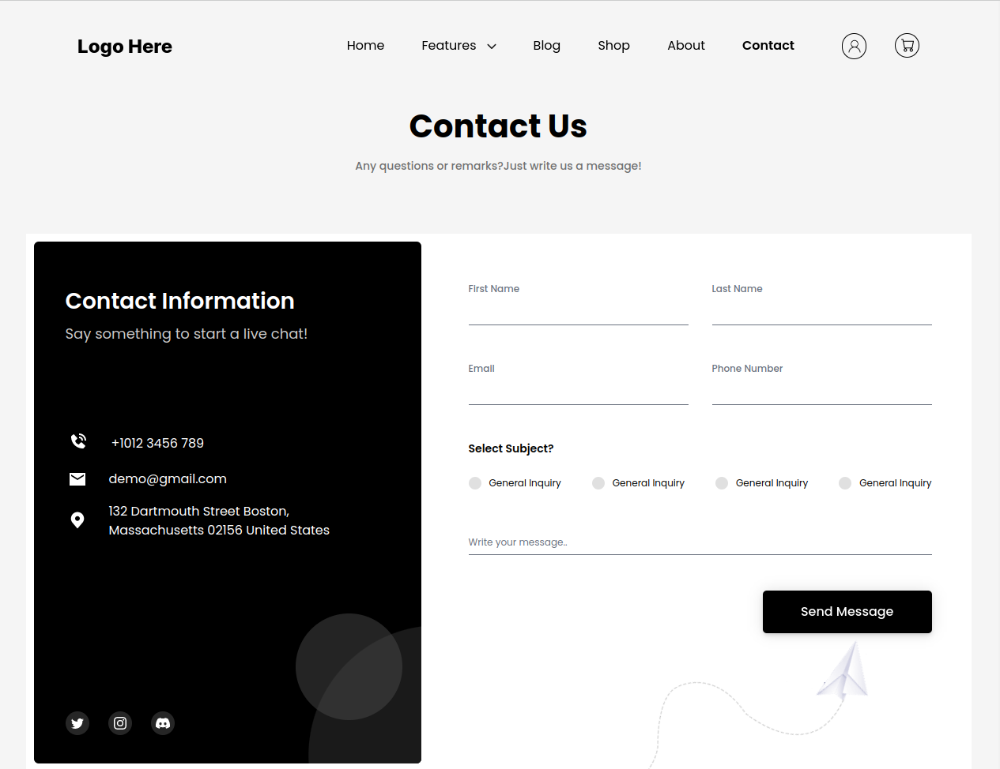

# Contact Page according Figma file using React

### Mbunity Development technical assessment for React Frontend Engineer.

---

### Results:

### 

[Deployed App](https://contact-page-bildii.vercel.app "Deployed App")

---

### Main Technologies used during the produced task:

-   React
-   TypeScript
-   React Router
-   React Hook Form
-   React-Query
-   Axios
-   json-server
-   Tailwind CSS
-   Headlessui
-   ESLint and Prettier
-   Vite

---

### Instructions to run the code

1. Start the temporary server

Use next command

```
npm run server
```

for start the temporary server and collect information from forms on the Contact page.

The running server provides an opportunity to test the forms from the Contact page.

Completed and submitted forms will be stored in the **`db.json`** file, which is located in the root directory of the project.

2. Start the app

Use next command

```
npm run dev
```

---

### About

Please note that the project was created using the **`Vite`** development environment.

By launching the application, you get to the main page of the site (**Home page**).

The application implements a routing system.
Using the links you can go to the **Contact page**.

There are **two forms** on the contact page.

**The first form** allows users to specify the First Name, Last Name, Email, Phone, select the appropriate options and write an accompanying message.

**The second form** allows users to submit their email address to subscribe to the Newsletter.

Both forms use **`Yup`** for validation.

To store user information temporarily used **`json-server`**, which keeps information sent by the user in the **db.json file**.

Sending information received from the user is carried out using **`React-Query`**, which ensures that information is sent to the server.

The project is done with the implementation of **responsive** design.

Styling done with **`Tailwind CSS`**.
